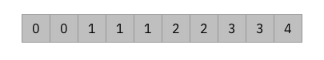
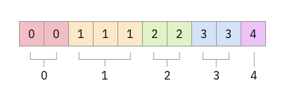
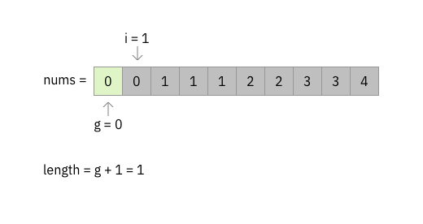

## Problem:

Given a sorted array `nums`, remove the duplicates in-place such that each
element appear only once and return the new length.

Do not allocate extra space for another array, you must do this by **modifying
the input array** in-place with O(1) extra memory.

### Examples 1:

```
Given nums = [1,1,2],

Your function should return length = 2, with the first two elements of nums being 1 and 2 respectively.

It doesn't matter what you leave beyond the returned length.
```

### Examples 2:

```
Given nums = [0,0,1,1,1,2,2,3,3,4],

Your function should return length = 5, with the first five elements of nums being modified to 0, 1, 2, 3, and 4 respectively.

It doesn't matter what values are set beyond the returned length.
```

## Analysis

A common way to remove duplicates of a collection is by using `Set`.
Mathematically, set is a collection of distinct objects. We can iterate over
`nums` and put each nubmer into the set to get the result. However, it need O(n)
extra memory for the set, thus **NOT** applicable to this problem.



In this case, we notice that `nums` is sorted which means the same numbers are
sitting together: it is already divided into groups and each group is
**uniquely** labeled with a number.



The problem can be solved by finding **how many groups in the given sorted
array, and what's the number within the each group respectively.**

## Solution

To find the number of groups, we can iterate over `nums` and remember the
labeled number of current group. Everytime we find a different number, there is
a new group. We remember the newly labeled number and continue until the end.



### Special Case

If the length of `nums` is zero, we simply return zero.

## Code (Java)

```java
public class Solution {
    public int removeDuplicates(int[] nums) {
        if (nums.length == 0) {
            return 0;
        }

        int groupIndex = 0;
        for (int i = 1; i < nums.length; ++i) {
            if (nums[i] != nums[groupIndex]) {
                groupIndex += 1;
                nums[groupIndex] = nums[i];
            }
        }

        return groupIndex + 1;
    }
}
```
